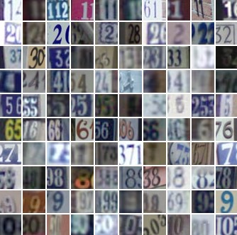
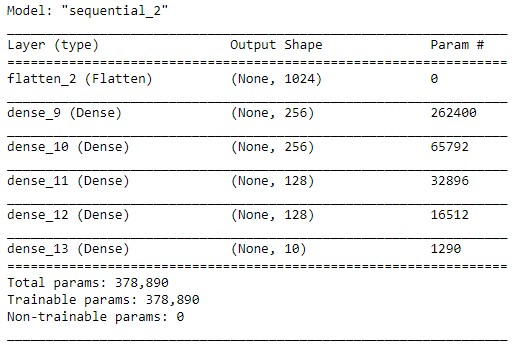
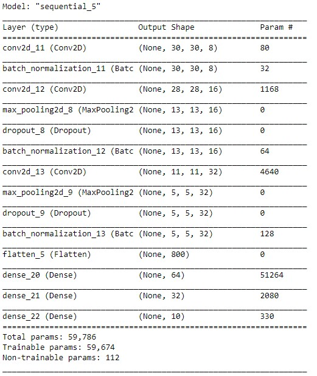
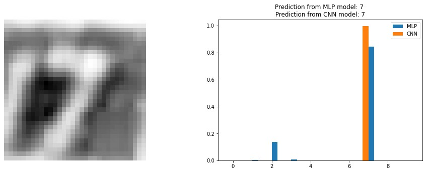
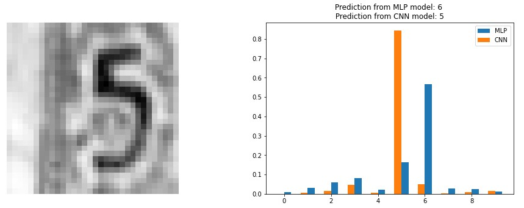

# Digit Image Classififier for SVHN Dataset
Two neural networks, MLP-NN and CNN, that classify real word image of digits from SVHN dataset.

Both neural networks are trained on a subset of SVHN dataset including 73257 training data and 26032 test data. In each case, 10% of training data are used for validation purpose.
Input images are 32*32*3. The training is applied to the grey scale images of 32*32*1 obtained through preprocessing of data.

MLP Model:
* l2 regularization
* He weights initializer
* ones bias initializer
* relu and softmax activations
* test accuracy 0.727

CNN Model:
* l2 regularization
* He weights initializer
* ones bias initializer
* batchnrmalization
* dropout
* relu and softmax activations
* test accuracy 0.901 

Some sample predictions of models:

