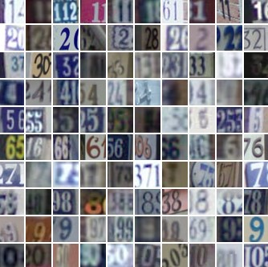
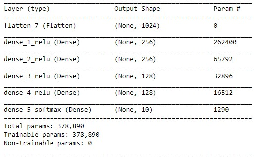
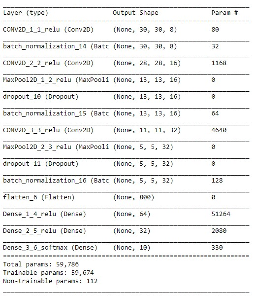
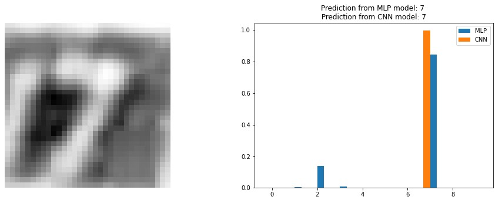
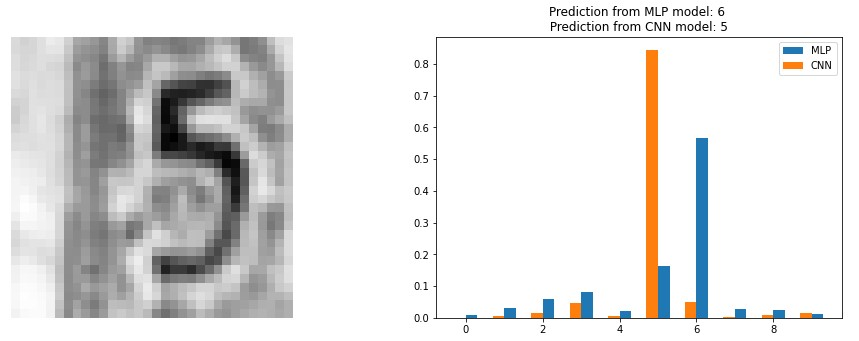
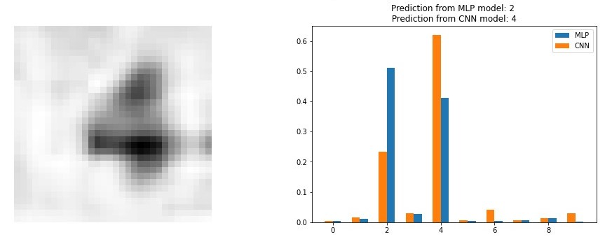

# Digit Image Classififier
Two neural network models,Multilayer Perceptron Neural Netowrk (MLP-NN) and Convolutional Neural Network (CNN) , that classify real word image of digits.

Due to privacy issues, the models are trained for SVHN dataset here.  
Same model can be trained for a dataset including Persian numbers
[SVHN dataset](http://ufldl.stanford.edu/housenumbers/)  

Both neural networks are trained on a subset of SVHN dataset including 73257 training data and 26032 test data. In each case, 10% of training data are used for validation purpose.
Input images are 32*32*3. The training is applied to the grey scale images of 32*32*1 obtained through preprocessing of data.

MLP Model:
* l2 regularization
* He weights initializer
* ones bias initializer
* relu and softmax activations
* test accuracy 0.727

CNN Model:
* l2 regularization
* He weights initializer
* ones bias initializer
* batchnrmalization
* dropout
* relu and softmax activations
* test accuracy 0.901 

Some sample predictions of models (a comparison between two models):  
1- **Both models predict correctly:**  

  
 2- **Only CNN model predicts correctly:** 

  
 3- **Only CNN model predicts correctly:** 

